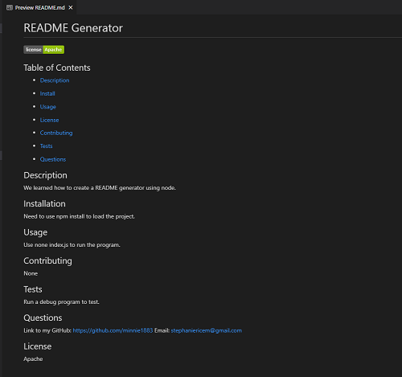

# README Generator

## Table of Contents

- [Description](#description)

- [Install](#installation)

- [Usage](#usage)

- [License](#license)

- [Contributing](#contributing)

- [Tests](#tests)

- [Questions](#questions)

## Description

We learned how to create a README generator using node.

## Installation

Need to use npm install to run.

## Usage

Enter node index.js to run the generator.

## Contributing

Stephanie Rice

## Tests

Run a debug program to find any issues.

## Questions

Link to my GitHub: https://github.com/minnie1883
Email: stephaniericem@gmail.com

## License

Apache

## Video

Link to my video: https://drive.google.com/file/d/1rLF079sGP7Y-Su6Hg17l9zeT-PcI0_Zx/view?usp=sharing

# Sample

Sample of README run in the video below:

